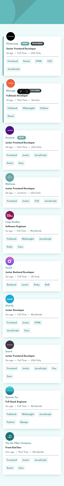
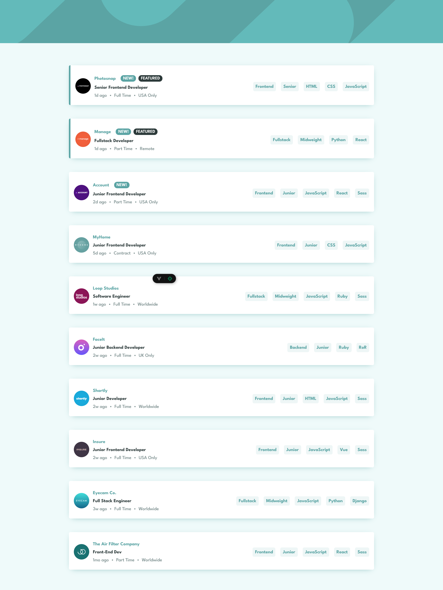

# Frontend Mentor - Job listings with filtering solution

This is a solution to the [Job listings with filtering challenge on Frontend Mentor](https://www.frontendmentor.io/challenges/job-listings-with-filtering-ivstIPCt).

## Table of contents

- [Overview](#overview)
  - [The challenge](#the-challenge)
  - [Screenshot](#screenshot)
  - [Links](#links)
- [My process](#my-process)
  - [Built with](#built-with)
  - [What I learned](#what-i-learned)

## Overview

### The challenge

Users should be able to:

- View the optimal layout for the site depending on their device's screen size
- See hover states for all interactive elements on the page
- Filter job listings based on the categories

### Screenshot

Mobile

Desktop

### Links

- [Solution URL](https://github.com/jcnevess/static-job-listings)
- [Live Site URL](https://jcnevess.github.io/static-job-listings/)

## My process

### Built with

- Vue.js
- Flexbox
- CSS Grid
- Mobile-first workflow

### What I learned

In this project I dove into reactive state management using vue.
I also learnt to import data and exercised event handling.
